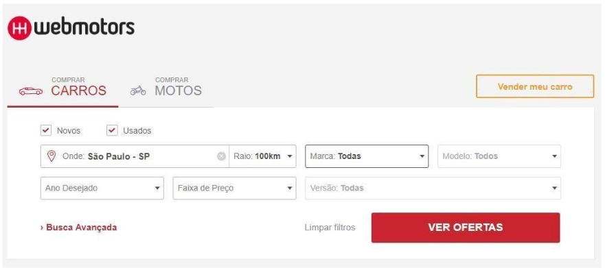

# Project Web Motors

# Desafio Front-End - Aplicação Web Para Compra e Venda de Veículos Automotores :computer:

- O usuário desta aplicação poderá pesquisar veículos novos e usados.

- As informações são consumidas via `Webservice` através da aplicação open source `Swagger`.

___

## :satellite: [Acesse aplicação web clicando aqui]() :computer:

___

## Objetivo do teste

- O usuário desta aplicação poderá pesquisar veículos novos e usados com objetivo de inovar e facilitar a compra e venda online de forma segura e prática.

___

## Contexto

- Criar página inicial de acordo com a regra de negócio:

___

- Cosumir da  Webservice `Marcas`;
- Cosumir da  Webservice `Modelos`;
- Cosumir da  Webservice `Versões`;
- Cosumir da  Webservice `Veículos`;
- Ao realizar pesquisar sera renderizado o(os) veículo(os) de acordo com a(as) opção(ões) selecionada(as);

___

## Regras de negócio

- Criar página inicial de acordo com modelo;
- Criar todos componentes contidos na tela inicial;
- Atender as seguintes especificações técnicas:

1. O box deve possuir o tamanho máximo de `933x312px`;
2. O mobile `não` tem layout definido, portanto fica a sua interpretação;
3. Construa utilizando `ReactJs` ou Vanilla (js puro);
4. `Não` utilize frameworks como Bootstrap, Materialize etc...;
5. `Não` utilize jQuery;
6. `Não` envie junto ao teste a pasta node-modules, ela é criada ao rodarmos o script de instalação.
7. Além da tela, é esperado o consumo do Webservice de consulta de marcas, modelos e versões
que se encontra no formato Swagger no [endereço](https://desafioonline.webmotors.com.br/swagger/ui/index#/OnlineChallenge);
8. Qualquer ação adicional será levada em conta, faça o máximo que conseguir!

___

## 🛠 Tecnologias

As seguintes ferramentas foram usadas na construção do projeto `Front-End`:

- JavaScript
- [ReactJS](https://reactjs.org)
- [Axios](https://www.npmjs.com/package/axios)
- [Git](https://git-scm.com)
- [GitHub](https://github.com/)
- [Heroku](https://www.heroku.com/)
- [Sass](https://sass-lang.com/)
- [React Icons](https://react-icons.github.io/react-icons)

___

> # Demonstração da aplicação

### :satellite: Publicação do `Front-End` em um serviço cloud de hospedagens :computer:

- [Acesse aplicação completa clicando aqui]()

___

### Autor

### :black_nib: Cássio Rubens 🚀

- [Portfólio](https://cassiorubens-cr.github.io/portfolio/)
- [GitHub](https://github.com/CassioRubens-CR/project-web-motors)
- [Linkedin](https://www.linkedin.com/in/cássio-rubens)
